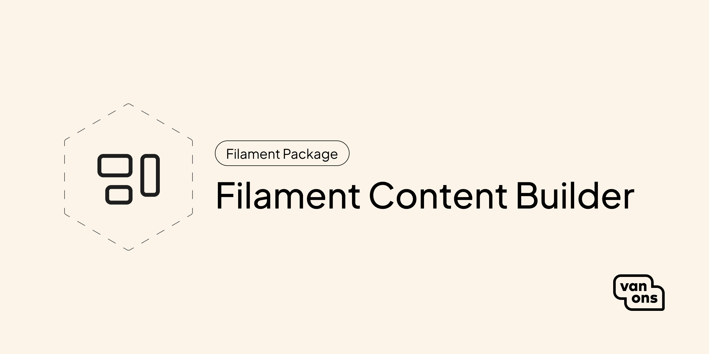

<p align="center" class="filament-hidden"></p>

# Filament Content Builder

[](https://github.com/VanOns/filament-content-builder/releases)
[](https://packagist.org/packages/van-ons/filament-content-builder)
[](https://github.com/VanOns/filament-content-builder/issues)
[](https://github.com/VanOns/filament-content-builder/blob/main/LICENSE.md)
[](https://plumbphp.dev/van-ons/filament-content-builder)

Add a customizable content builder to your Filament admin panel, complete with a set of frequently used content blocks.

## Quick start

> For Filament version compatibility, see [Compatibility](docs/compatibility.md).

### Installation

Start by installing the package via Composer:

```bash
composer require van-ons/filament-content-builder
```

### Usage

Add the `ContentBlocksRenderer` field to your Filament resource:

```php
use VanOns\FilamentContentBuilder\Fields\ContentBlocksRenderer;

ContentBlocksRenderer::make('content')
    ->label(__('Content'))
    ->required(),
```

Then render the blocks in your Blade view:

```blade
<x-filament-content-builder::block-renderer :blocks="$post->content" />
```

## Documentation

Please see the [documentation](docs) for detailed information about installation and usage.

## Contributing

Please see [Contributing](CONTRIBUTING.md) for more information about how you can contribute.

## Testing

```bash
composer test
```

## Changelog

Please see [Changelog](CHANGELOG.md) for more information about what has changed recently.

## Upgrading

Please see [Upgrading](UPGRADING.md) for more information about how to upgrade.

## Security

Please see [Security](SECURITY.md) for more information about how we deal with security.

## Credits

We would like to thank the following contributors for their contributions to this project:

- [All contributors](../../contributors)

## License

The scripts and documentation in this project are released under the [MIT License](LICENSE.md).

---

<p align="center"><a href="https://van-ons.nl/" target="_blank"></a></p>
